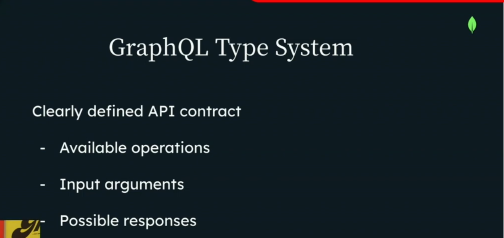
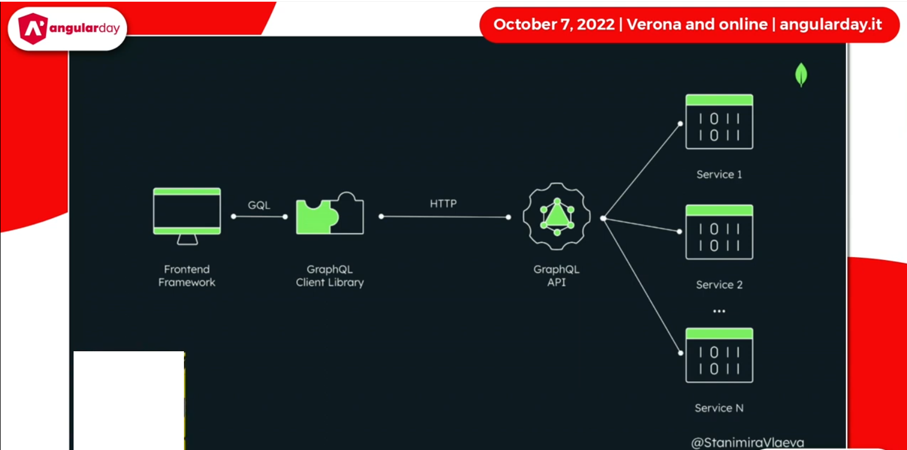
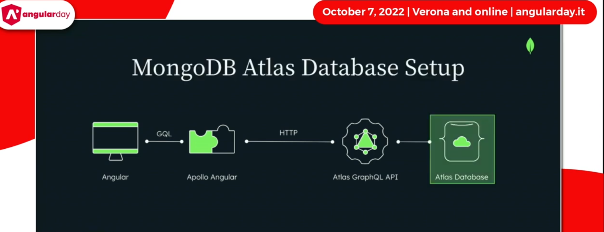
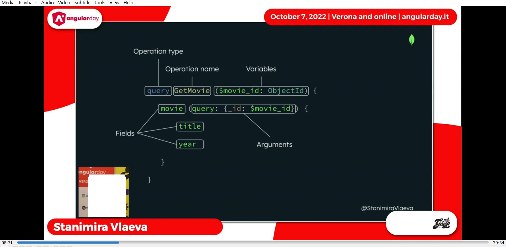
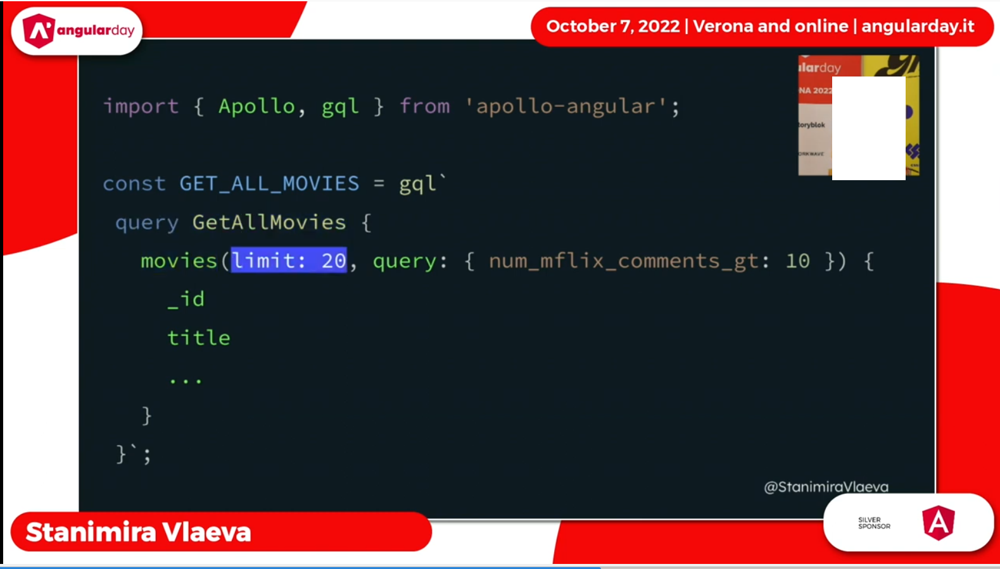
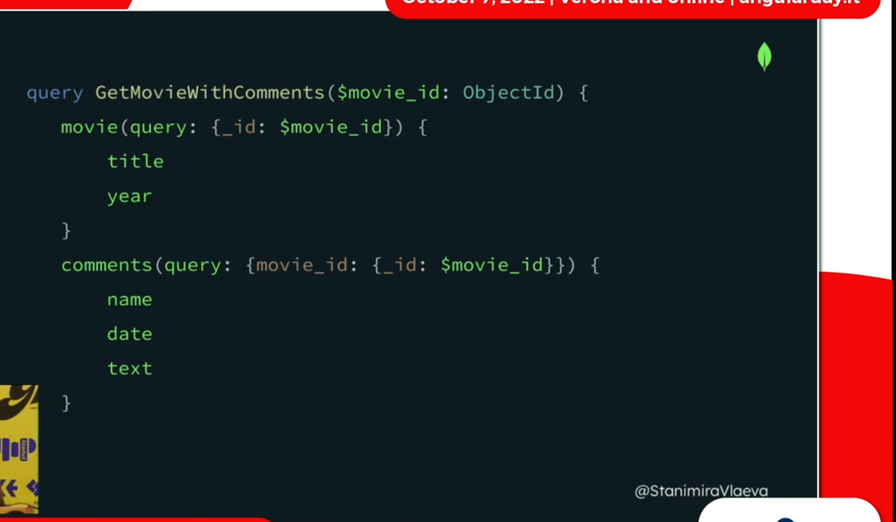
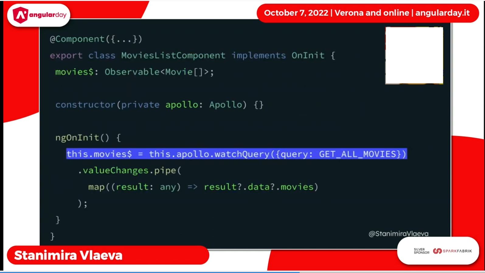
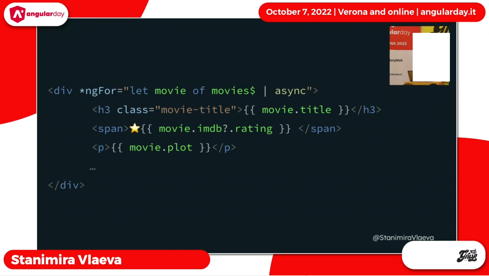
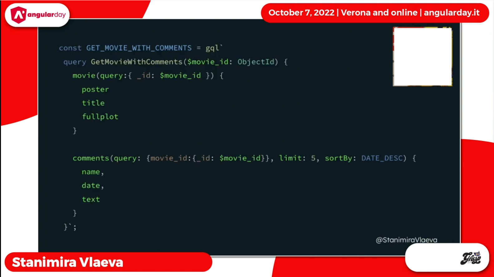
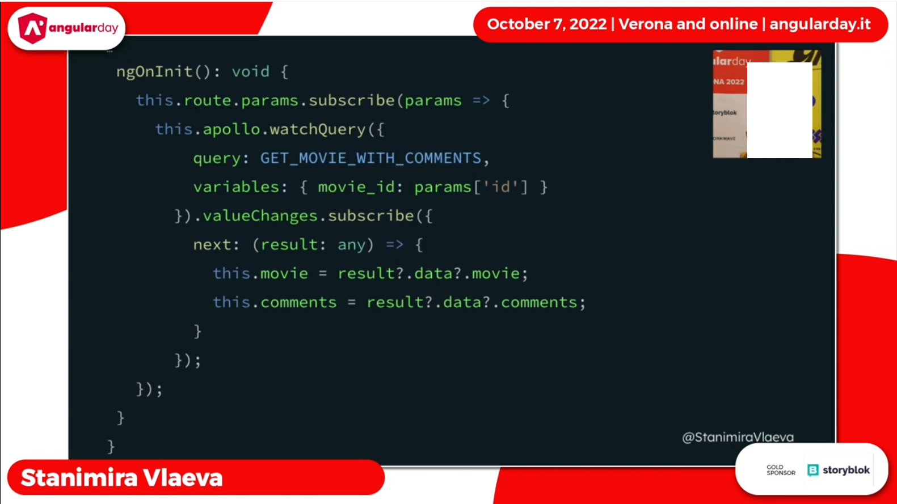

# GRAPHQL NOTES & ANGULAR IMPLEMENTATION

### GRAPHQL ARCHTECTURE

### GRAPHQL ARCHTECTURE MONGODB ATLAS

### GraphQL Query Language(GQL)

### GQL querying

### Angular example

### displaying data

### GQL Multiple Entity

#### example

### Angular example multiple entity

## GQL MUTATION
